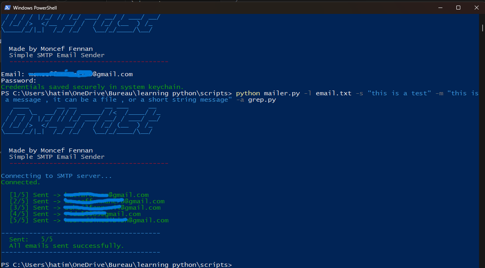

#  Python Mailer

A simple but powerful CLI-based SMTP email sender built in Python.  
Made by **Moncef Fennan** ([@m0nc3f3](https://github.com/m0nc3f3))

--- 

## example usage


## Features

-  Send emails to multiple recipients from a list file
-  Attach multiple files of any type
-  Secure credential storage via OS keychain (no plaintext passwords)
-  Fully configurable SMTP server and port (Gmail, Outlook, Yahoo, custom)
-  Auto-reconnects if SMTP connection drops mid-send
-  Smart delay between sends to avoid spam detection
-  Colorful CLI output with progress tracking
-  Summary report at the end (sent / failed)

---

## Requirements


- A Gmail account with an [App Password](https://myaccount.google.com/apppasswords) (2FA required)

---

## Installation

```bash
git clone https://github.com/m0nc3f3/python-mailer.git
cd python-mailer
pip install -r requirements.txt
```

---

## Setup

Store your credentials securely in your OS keychain before first use:

```bash
python mailer.py --setup
```

You will be prompted for your email and App Password. Credentials are stored in:
- **Windows** → Windows Credential Manager
- **Mac** → Keychain
- **Linux** → GNOME Keyring / KWallet

---

## Usage

```bash
python mailer.py -l <email_list> -s <subject> -m <message>
```

### Arguments

| Argument | Description |
|---|---|
| `-l`, `--list` | Path to a `.txt` file with one email address per line |
| `-s`, `--subject` | Email subject line |
| `-m`, `--message` | Message body — either a `.txt` file path or a raw string |
| `-a`, `--attach` | One or more file paths to attach |
| `--smtp-server` | SMTP server address (default: `smtp.gmail.com`) |
| `--smtp-port` | SMTP server port (default: `587`) |
| `--setup` | Store credentials in system keychain |

---

## Examples

**Basic send:**
```bash
python mailer.py -l emails.txt -s "Hello" -m message.txt
```

**With attachments:**
```bash
python mailer.py -l emails.txt -s "Report" -m message.txt -a report.pdf photo.jpg
```

**Inline message:**
```bash
python mailer.py -l emails.txt -s "Quick note" -m "Hey, just checking in!"
```

**Custom SMTP server (e.g. Outlook):**
```bash
python mailer.py -l emails.txt -s "Hello" -m message.txt --smtp-server smtp.office365.com --smtp-port 587
```

---

## Email List Format

Plain `.txt` file, one address per line:

```
alice@gmail.com
bob@outlook.com
charlie@yahoo.com
```

---

## Dependencies

```
pyfiglet
colorama
keyring
```

Install all at once:
```bash
pip install -r requirements.txt
```

---

## Notes

- Gmail requires an **App Password**, not your regular account password. Generate one at [myaccount.google.com/apppasswords](https://myaccount.google.com/apppasswords)
- Delays between sends are automatic and scale with list size to avoid spam filters
- If a single email fails, the script continues and reports failures at the end

---

## License

MIT License — free to use, modify, and distribute.
